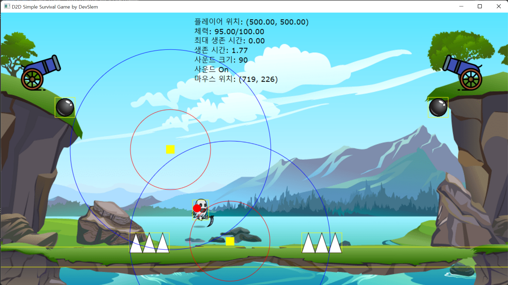

# D2DSimpleSurvivalGame

[Direct 2D](https://docs.microsoft.com/ko-kr/windows/win32/learnwin32/your-first-direct2d-program) API를 사용하여 만든 간단한 게임이다. 게임은 적들을 피해 오래동안 살아남으면 되는 간단한 게임이다.

#### 조작 방법

* 이동: WASD
* 음량 조절: up/down key
* 음소거: P
* 적 공격: Mouse Click

#### Platform

* Windows

## Implementation

[Unity](https://unity.com/kr)와 유사한 시스템을 구축하였다. Component와 Game Object 기반으로 동작한다. 충돌 시스템은 AABB collision 기반이다. 렌더링은 `Update`에서 물리 처리는 `FixedUpdate`에서 수행된다. 엔진을 구성하는 주요 class는 아래와 같다.

* Transform 
* GameObject
* Component
* Rigidbody
* RectCollider
* Renderer

위 시스템은 `D2DEngine` 프로젝트에 구현되어있다.

## Asset References

게임 개발에 사용된 Asset 출처는 아래와 같다.

### Image References

* [background](https://wallpapersafari.com/w/EXVgK1)
* [cannon](https://www.flaticon.com/kr/free-icon/cannon_1973575#)
* [cannon-bullet](https://opengameart.org/content/bullets-game-asset)
* [ghost](https://www.pngegg.com/en/png-zedgi)

### Sound References

* [background](https://seo6285.tistory.com/212)
* [cannon-fire](https://soundeffect-lab.info/)
* [heavy-attack](https://soundeffect-lab.info/)
* [light-attack](https://soundeffect-lab.info/)